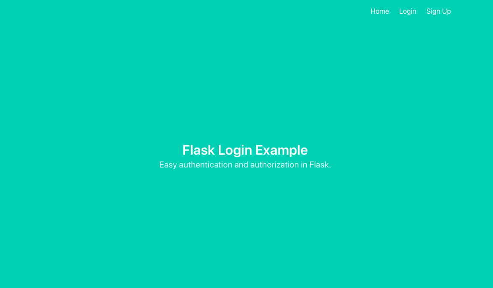
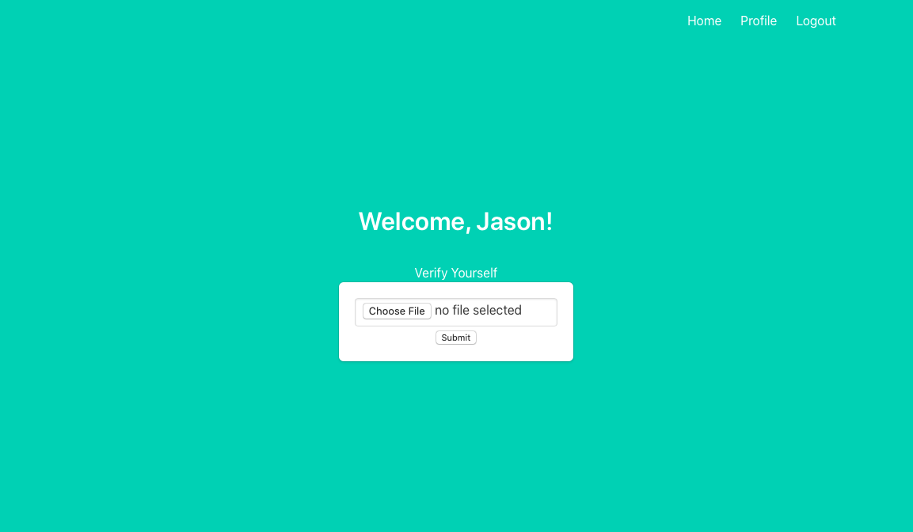

# Basic-Flask-Login-File-Uploads
Basic User Management and File Uploads with Flask Framework

1. Install dependencies in requirements.txt
2. Run Command: flask run

###### Source: https://www.digitalocean.com/community/tutorials/how-to-add-authentication-to-your-app-with-flask-login

\

